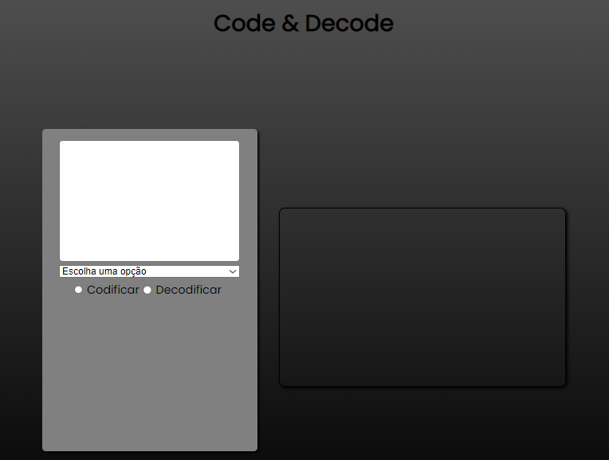

<h1 style="text-align: center;">Projeto Individual - Módulo 2 </h1>
<h2 style="text-align: center;">Code  & Decode</h2>
 

Feito por - Leonardo Santos 

 
 
<h3 style="text-align: center;">Sobre o projeto</h3>

 Criar um programa capaz de codificar e decodificar palavras/textos em base64 e Cifra de Cesar.

  
<h3 style="text-align: center;">Como usar</h3>

Digite o que deseja criptografar / Selecione a griptografia que deseja usar /Escolha se deseja codificar ou decodificar / Para a cifra de cesar séra necessário escolher um valor para deslocar as letras / Depois é só apertar o botão para que o programa seja executado!

<h3 style="text-align: center;">Linguagens utilizadas</h3>

    

        
HTML

        
    

    

        
CSS

        
    

    

        
Javascript

        
    

 
<h3 style="text-align: center;">Desenvolvimento do Projeto</h3>

  O projeto foi desenvolvido através do <strong>Visual Studio Code</strong> para criar os códigos e <strong>GitHub</strong> para guardar o projeto.

    
    

 
<h3 style="text-align: center;">Acesso ao Projeto</h3>

  O projeto pode ser acessado pelo GitHub Pages através do link: 
https://lleosantos.github.io/ProjetoIndividual2/

